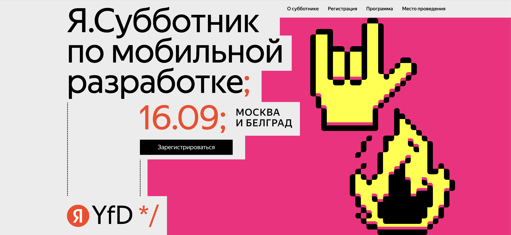

# This is a playground code from my talk at [Yandex Subbotnik Mobile meetup at 16.09.2023](https://yfd-events.com/subbotnikmobile-16-09-23)

### Where to Start
Here you can find the basics and core ideas that you can experiment with.

In the package `gametalk/playground`, you'll find the `GameLoops101.kt` file that contains theory from the talk about game loops.

---
The package `engine` contains a simple engine architecture that demonstrates the main idea about how things work.
In the package `engine/gameloop`, you'll find three different approaches on how to set up your game loop.

---
The package playground/scene contains a few scenes that show how rendering works and its performance.
